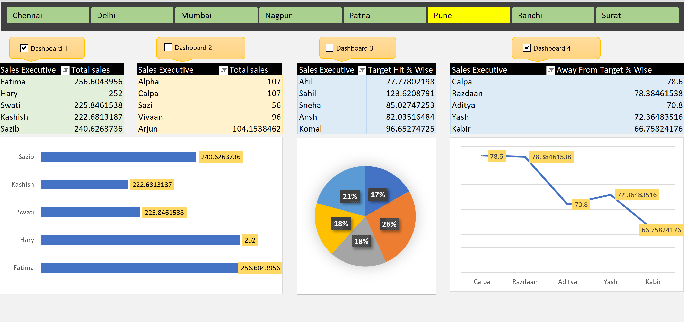

# Sales Performance Dashboard – Excel

## 📊 Project Overview

An interactive Excel dashboard developed to analyze sales performance, track key business metrics, and visualize sales trends for data-driven insights.

The dashboard provides a clear overview of sales performance and helps identify trends and patterns through interactive visualizations and summary metrics.

## 🎯 Objective

The objective of this project is to analyze sales data and understand:

- Overall sales performance
- Sales trends over time
- Product-wise performance
- Key sales metrics
- Performance patterns and trends

## 🛠️ Tools & Technologies

- Microsoft Excel
- PivotTables
- PivotCharts
- Excel formulas
- Data Visualization

## 🔄 Data Preparation

The data was prepared and organized in Excel before creating the dashboard.

Key steps included:

- Data cleaning
- Data formatting
- Data organization
- Creating calculated metrics
- Preparing data for PivotTables and visualizations

## 📈 Dashboard Features

The dashboard includes:

- Sales performance overview
- Key sales metrics
- Sales trend analysis
- Product-wise analysis
- Interactive charts
- PivotTable-based analysis
- Visual representation of sales performance

## 🔍 Key Insights

The dashboard helps identify:

- Overall sales performance and trends
- Products contributing to sales
- Changes in sales over time
- Important patterns in the sales data
- Areas that can be further analyzed for business improvement

## 🖼️ Dashboard Preview

## 📁 Files in this Repository

- `Dashboard_view.png` — Dashboard screenshot
- `Sales_Performance_Dashboard_project.xlsm` — Interactive Excel dashboard
- `Sales_Performance_Dashboard_project.pdf` — Raw Data
- `README.md` — Project documentation

## 📌 Project Type

Data Analytics | Excel Dashboard | Business Analysis | Data Visualization

## 👩‍💻 Author

**Saziya Naushad**

Data Analyst | SQL | Power BI | Excel | Python
